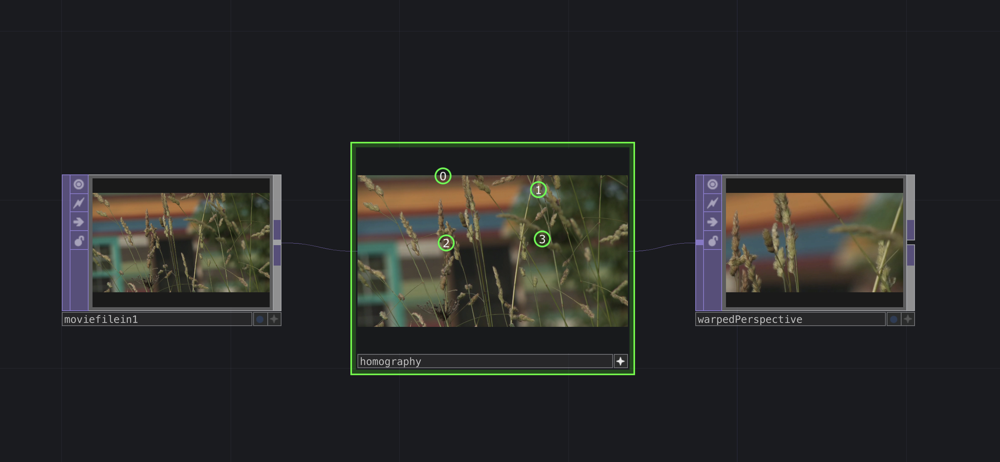

# TouchDesigner Homography

A very simple example using openCV to do homography in TouchDesigner. Adjust the points to choose a portion of the input to be output as a rectangular image. Set the output width and height inside the homography container.

